## Project Motivation

Yelp has almost 180 million unique monthly visitors. Over 565,000 restaurants pay to advertise on Yelp, and many more are listed for free. Customers use Yelp reviews to decide where to eat, which has a meaningful impact both on the customers and local businesses.

The effectiveness of the service that Yelp provides relies on the authenticity of reviews. There are strong incentives to leave fake reviews, so it is necessary to identify and remove reviews that are not authentic. We train machine learning models on features relating to the review, the reviewer, and the restaurant to determine if a review is authentic or fake.

## Problem Statement

In today’s world, product reviews are essential to determine the quality of the service providers, and affect the sales by the business. However, there has been an escalation of fake product reviews that can mislead other customers in their choices and decisions. Repercussions of such fake product reviews can affect both the customer and the service providers. With the advent of online service providers and e-commerce platforms, it has become necessary to identify fake reviews and ensure the integrity of the reviewing process. 

In this project, we use Yelp review dataset to classify genuine reviews. We demonstrate the efficacy of review features as inputs to unsupervised and supervised learning models and leverage the information available on user interactions.

Once we identify the fake reviews and filter them out, we created a question answering process where we answer the user questions pertaining to a restaurant using the genuine reviews. This helps user to get up to date and unbiased opinion about a particular dish or about the restaurant itself.

## Importance and relevance

With the advent of e-commerce, an illegal market of fake reviews has emerged. Fake reviewers get paid which is ultimately reflected in the form of false information transferred to end user. This has serious consequences such as loss of brand reputation and failure in predictive models that utilize the review information.

On a different note, users are now being bombarded with a lot of textual information. If a user wants an answer to a particular question, s/he has to read through the information overload which not only reduces user engagement but also movement to some other service. A system that provided user with relevant text for answering the question would be of vital importance in this scenario.

## Data

The Yelp review data has been acquired in 2 stages. The labelled review dataset for New York and Chicago was provided by the courtesy of Dr. Shebuti Rayana [1]. Additional requisite data was pulled using the Yelp API.

The original features are:

* Reviewer's Yelp ID
* Product ID
* Rating (from 1 to 5 stars)
* Date of review

The features pulled using Yelp API are:
* Latitude
* Longitude
* Zipcode
* Complete Name

## Data Engineering

Some features that were not needed for the model, such as date and user ID, were dropped from the dataset. 

A number of features were generated using the existing data which are as follows:

Review based:
* Word count of review
* Character count of review
* Punctuation count
* Uppercase count

User based:
* Number of reviews given by a user
* Average rating given by a user
* Average word written in a review for a user
* Number of reviews written each day by a user

Product based (Product refers to either a restaurant or a hotel):
* Number of reviews for a product
* Average rating given for a product
* Average word written in a review for a product
* Number of reviews written each day for a product

Then the separate datasets (one each for restaurants in New York City and Chicago, and hotels in Chicago) were merged into one.

Approximately 70% of the reviews in the dataset were labeled as authentic; without upscaling the fake reviews, the models would classify almost everything as authentic. To avoid this issue, the fake reviews were upsampled such that there were an equal number of authentic and fake reviews.

The dataset was then split into training and testing sets, with the labels being removed from the testing set for the supervised learning models and from both the training and testing sets for the unsupervised learning models. This was considered as the final and cleaned dataset to be used as a model input.

[Jump to Comparison](#Comparison)
## Supervised Learning: Fake Review Detection

## Approach
In this section of the project, we analyzed restaurant reviews on Yelp from the cities of New York and Chicago, using a variety of supervised machine learning techniques. 

We used supervised learning methods like Logistic Regression, Gradient Boosting Tree, CNN, and BERT to compare the results and how they're able to classify the reviews as fake or genuine reviews. Each of the models are discussed in detail below. We also compare the model results and their statistics after discussing each model.

## Modeling 

### Logistic Regression - Baseline
#### Model architecture
Logistic regression is a statistical model that utilizes logistic function to model a binary dependent variable. The basic model is as follows:

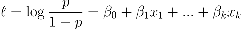

where l represents the log odds of having a fake review.

#### Reasoning
The reasoning behind choosing logistic regression as a baseline model is that it is basic in its structure and does not require too much of computational power. More importantly, the model is statistically interpretable. 
#### Model parameters
* Penalty Type = L1
* Tolerance Level = 0.00001
* Maximum Iterations = 10000
* Solver type = ‘lbfgs’

#### ROC Curve and threshold selection

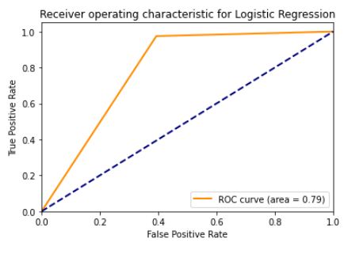

#### Confusion matrix

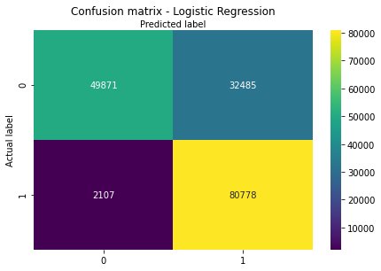

#### Prediction Scores

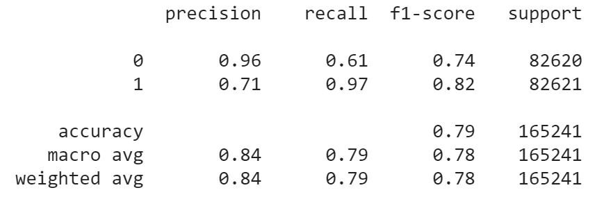

#### Inference
It is important to note that the average accuracy of the model is 84% which is very good considering its simplicity of the model. Moreover, the important aspect of the model is that coefficients are directly interpretable and reveal important information as to how the log odds of a review change as and when the variable value is changed.

### Convolutional Neural Network (CNN)
#### Model architecture
6 hidden layers - fully connected layers for reviews. 
All hidden layers use ReLu activation and use softmax for classification and all hidden layers are L2 regularized. 
Categorical cross entropy loss is minimized. 

Architecture of CNN

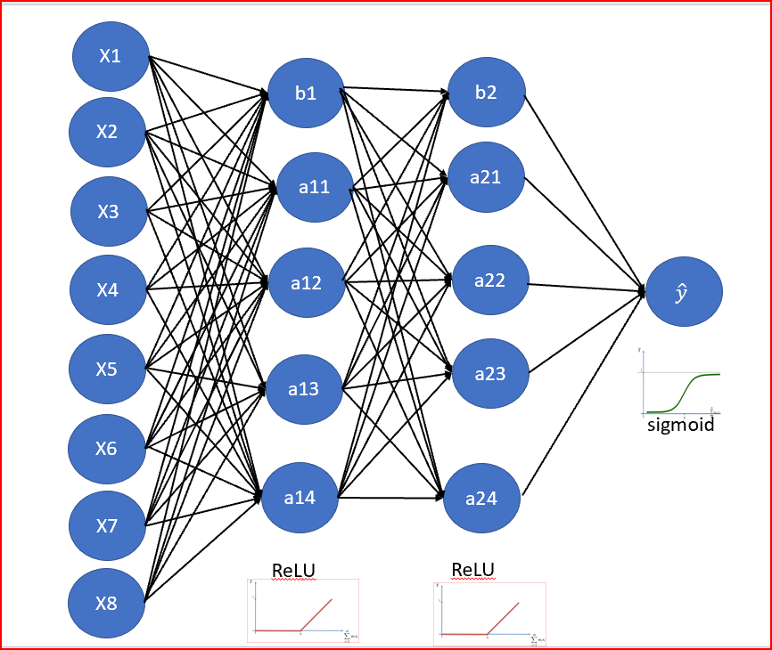

#### Model Hyperparameters
Following hyperparameters were used to train the CNN model

- Batch size = 16, 
- learning rate = 1e-3, 
- dropout = 0.1,
- normal initializer, 
- Adam optimizer, 
- L2 reg - 0.005

#### ROC Curve

From the curve below, we observe area under the curve to be 81%

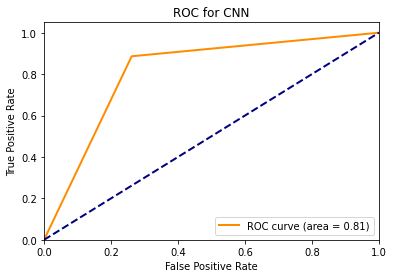

#### Confusion matrix

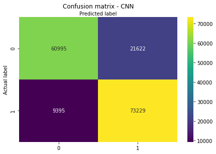

#### Prediction Scores

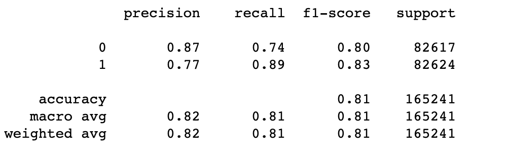

#### Inference
From the results above we get the accuracy of around 82% on our test dataset with the CNN algorithm.

### Gradient Boosting 

#### Model architecture

The Gradient Boosting Classifer model is based on iteratively adding weak learners to the model until they, collectively, become a strong learner. Each weak learner is a decision tree that attempts to classify the output nodes of the prior decision tree, unless those nodes are below a certain threshold of impurity. 

#### Reasoning

The Gradient Boosting Classifier is an effective model to use with this data because there are many features on which the decision trees can split. Additionally, GBM is robust against overfitting so it was expected to perform well on the test set. 

#### Model parameters

Following hyperparameters were used to train the Gradient Boosting Classifier model:

- Number of Estimators = 80, 
- Learning Rate = 0.80, 
- Maximum Features = 2,
- Maximum Depth = 4

#### ROC Curve and threshold selection

#### Confusion matrix

#### Prediction Scores

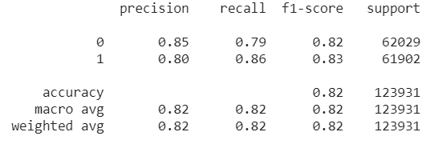

#### Inference

From these results, we can see that the model achieved around 82% accuracy on the test dataset, and an AUC score of 0.92. 

### BERT

#### Model architecture

BERT, Bidirectional Encoder Representations from Transformers, is a recent machine learning model created by Google AI Language. BERT is bidirectionally trained and therefore has a deeper sense of the language's understanding than a single-direction language model. 

There are essentially two steps in the BERT framework: pre-training and fine-tuning. During pre-training, the model is trained on unlabeled data over different pre-training tasks. For finetuning, the BERT model is first initialized with the pre-trained parameters, and all of the parameters are fine-tuned using labeled data from the downstream tasks. 

The model makes use of a transformer which consists of two mechanisms - encoder and decoder. The encoder reads the entire sequence of words in one go, whereas, the decoder generates a prediction for the task at hand. Therefore, the model is able to learn the context of the word from both the right and left direction.

To make BERT handle a variety of down-stream tasks, our input representation is able to unambiguously represent both a single sentence and a pair of sentences in one token sequence. A sentence, which we provide as an input to the model, is an arbitrary span of contiguous text, rather than an actual linguistic sentence.

For each task, we simply plug in the task specific inputs and outputs into BERT and finetune all the parameters end-to-end.

Following is the BERT input representation:

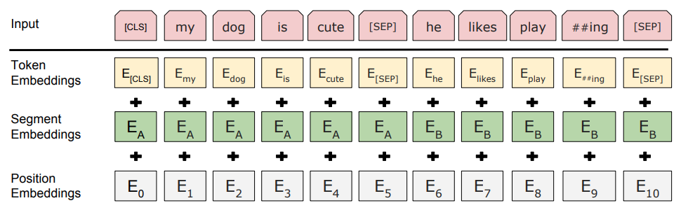

#### Reasoning

BERT has recently become extremely popular in the machine learning community after achieving superior results in a wide variety of NLP tasks. The key difference between BERT and other existing models is that it looks at a text sequence from left to right or right-to-left or both for training purposes. By using a novel technique - Masked Language Modelling (MLM), bidirectional training in our model is achieved.

Our goal with the BERT model is to achieve the classification with just the review and look at how the metadata performs.

#### Model parameters

Following hyperparameters were used to train the BERT model:

- Learning Rate: 2e-5
- Batch Size: 16
- Keep probability: 0.7
- Number of Training Epochs: 2.0

#### ROC Curve and threshold selection

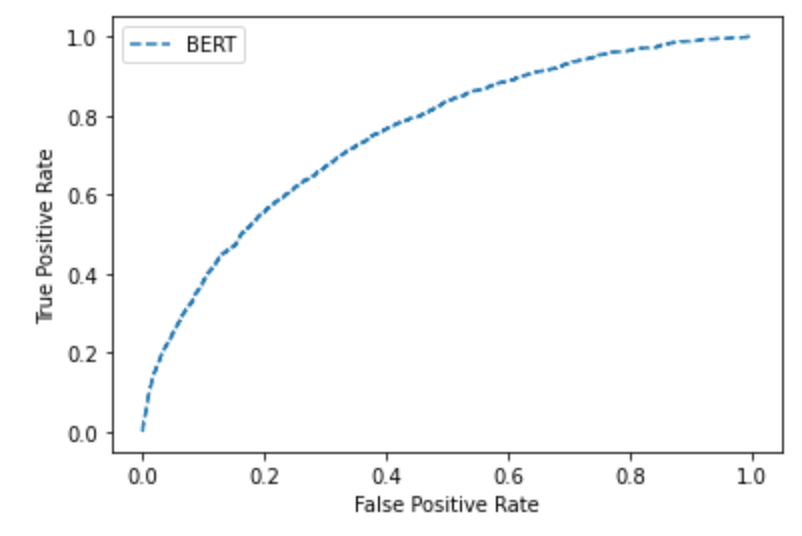

#### Confusion matrix

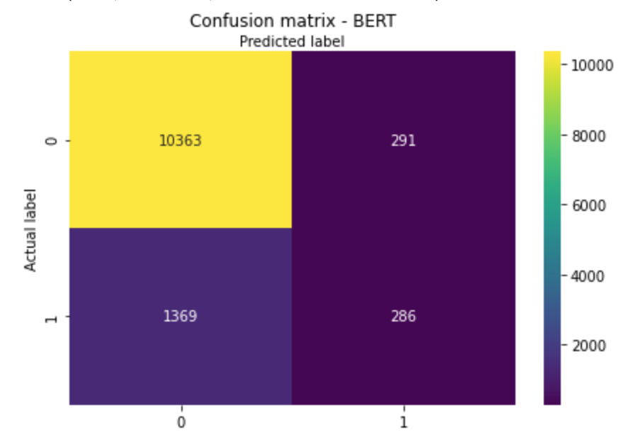

#### Prediction Scores

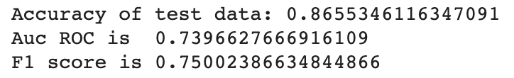

#### Inference

From the results above we can see that BERT achieved an accuracy of more than 86% on our test dataset.

## Comparison

Here is the comparison of all the models we used for supervised learning. 
Logistic Regression was used as the baseline model.

| Model               | Accuracy | F1 Score | AUC |
|---------------------|----------|----------|-----|
| Logistic Regression | 84%      | 79%      | 79% |
| CNN                 | 82%      | 81%      | 81% |
| Gradient Boosting   | 82%      | 82%      | 92% |
| BERT                | 86.5%    | 75%      | 74% |

### Example

For example, a sample fake review that we have is as follows:

“I will admit that I am a Manhattan snob.
I have done that thing where my friends try to get me to go to places outside of Manhattan and I'm just like...no, that's too far and it's probably not worth it. Salt and Fat is totally worth it. I was paranoid that there was going to be a massive wait.
As it turns out, 7:30 PM on a Sunday night must be the magical time because when I rocked up, there was no wait at all for our party of three..."

According to the logistic regression model, the number of reviews per user and punctuation count are the best indicator for a fake review. For the user who wrote this comment, the punctuation count for the whole comment is 53, which is very high and the number of reviews given are 11 which is also high. As a result, these values for this review increase the log odds of being a fake review and hence the model is able to predict it as a fake.

## Unsupervised Learning: Question-Answering

To introduce Unsupervised Learning, we decided to implement Question-Answering in our project. Since we already have the
data for the reviews of the restaurant, we decided to train a model to understand the context of the reviews and using that 
we are answering any questions that users have regarding the restaurant. 
Question-Answering, is the ability of a machine to read and understand unstructured text, and use that 
information to answer questions on it. Having a machine to do the same is a fundamental, interesting and challenging 
problem in Machine Learning. We are using the pretrained BERT model for this task, as BERT achieves state of the art results
for such type of tasks. For fine-tuning our model we are using the SQuAD2.0 dataset. 

### Model Architecture
We are using the pretrained BERT-Large Uncased
* Layers: 24
* Hidden: 1024
* Heads: 16
* Parameters: 340M  

#### Model Hyperparameters
  * Learning Rate: 3e-5
  * Max Sequence Length: 384
  * Train Epochs: 2
  * Batch Size: 24
  * Doc Stride: 128

### SQuAD2.0 Dataset

The Stanford Question and Answering Dataset (SQuAD2.0) provide with questions and answers on Wikipedia articles.
The questions are written by humans and answers are passages containing texts from the source. The dataset is publicly 
available and open-source, and have questions that require human-level reasoning skills to answer. 
The model answering a question is first fed a large amount of text documents or passages, and then is queried with questions 
with answers that are corresponding segments of the previous passages.

|                     | SQuAD2.0 |
|---------------------|----------|
| **Train**   Total examples   Negative examples   Total articles   Articles with negatives|    130,319    43,498     442   285         |
| **Development**   Total examples   Negative examples   Total articles   Articles with negatives|    11,873     5,945     35   35         |
| **Development**   Total examples   Negative examples   Total articles   Articles with negatives|    8,862   4,332   28   28 |

Finally, after fine-tuning the pretrained BERT model, we would feed our model with the top non fake reviews of the restaurant
that user selects, using that knowledge we would answer the questions that the user asks regarding the details of the restaurant.

### Results of finetuning BERT on SQuAD2.0
* Accuracy: 0.7726
* F1 Score: 80.426

### Example
#### Review Provided to the Model
"This was a while back, but decided to write a review anyway. It felt like i was entering a space ship, but once i got inside the place, I was amazed by the decor. It was simple and elegant. The center piece on our table was very unique, it was actually part of our meal. We had the tasting menu, each item was amazing. It's true that the flavors burst in your mouth, each item was uniquely prepared. The service was top notch!! Although it was the most expensive dinner I've ever had, the experience was truely amazing. Expect to spend $500+ for two people and 4-5 hours."
#### Question
Q1. What is the cost for two?

Q2. How much to spend for two?

#### Predicted Answer
A1. $500+

A2. $500+

Clearly, the model was able to understand the context for both the questions and was able to find the answer from the relevant reviews.

### Visualization - Chicago and NYC heatmaps

Here is the heatmap of the NY city which shows the density of fake reviews

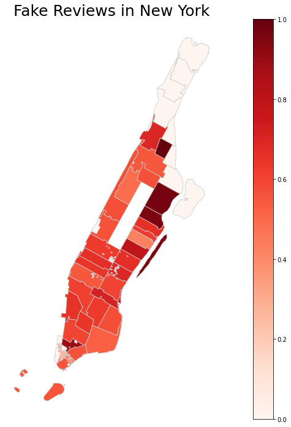

Similar analysis was done for Chicago as well which shows the zip codes with the density of fake reviews in the city

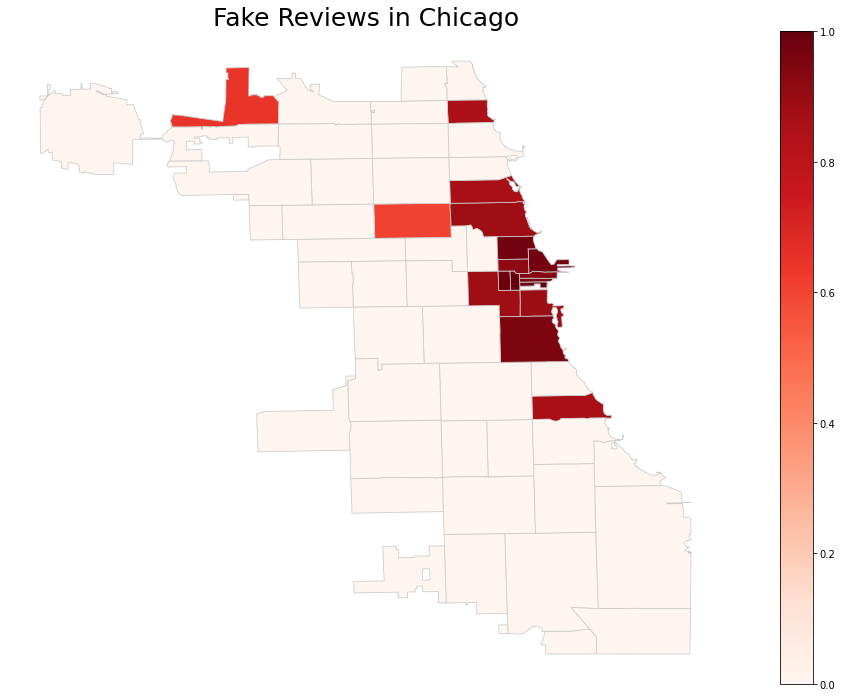

## Conclusion

Using the comparison chart, we can infer that the baseline model (logistic regression) have about 84% accuracy. The accuracy significantly improves with use of more complex models such as Gradient Boosting, Neural Networks and BERT. The filtered output from the fake review detector serves as an input to the Question Answering system which creates a complex pipeline ready to be deployed in the form of a feature for the website. This has huge monetary potential by bringing down the costs of hiring service executives for Yelp as well as the restaurants in addition to saving users’ and the firm’s time.

## Codebase and Data
Code for the project can be found here:
[Github repository link](https://github.gatech.edu/kahuja8/ML-Yelp-Reviews/tree/master/codebase)

Data can be provided by reference. Please reach out to the team members if you want access to the data.

## References

[1] Shebuti Rayana, and Leman Akoglu. "Collective opinion spam detection: Bridging review networks and
metadata." Proceedings of the 21th acm sigkdd international conference on knowledge discovery and data
mining. ACM, 2015

[2] Leman Akoglu, Rishi Chandy, and Christos Faloutsos. "Opinion fraud detection in online reviews by
network effects." Seventh international AAAI conference on weblogs and social media. 2013.

[3] Jacob Devlin, Ming-Wei Chang, Kenton Lee, and Kristina Toutanova. “BERT: pre-training of deep
bidirectional transformers for language understanding.” CoRR, abs/1810.04805, 2018.

[4] Pranav Rajpurkar, Jian Zhang, Konstantin Lopyrev, and Percy Liang. 2016. Squad: 100,000+ questions for machine comprehension of text. arXiv preprint arXiv:1606.05250.
